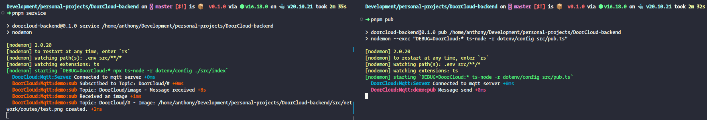

# Doorcloud Backend

## Prerequisites

To have installed the following:

- [Node.js](https://nodejs.org/) (>= 16)
- [pnpm](https://pnpm.io/) (>= 7)

A `.env` file with the correct variables specified in the `.env.example` file.

## Testing

At this point, we only can test receiving and sending messages manually or using the unit tests.

When testing manually, if everything went ok, the image [`basic_pub_sub_testing.png`](basic_pub_sub_test.png) will be copied to the folder `./src/network/routes/` with the name `test.png`.

### Receiving

To subscribe and receive messages in the default topic `DoorCloud` we have to run the following command:

```bash
pnpm service
```

We will get an output as follows:

```bash
> doorcloud-backend@0.1.0 service /home/anthony/Development/personal-projects/DoorCloud-backend
> nodemon

[nodemon] 2.0.20
[nodemon] to restart at any time, enter `rs`
[nodemon] watching path(s): .env src/**/*
[nodemon] watching extensions: ts
[nodemon] starting `DEBUG=DoorCloud:* npx ts-node -r dotenv/config ./src/index`
  DoorCloud:Mqtt:Server Connected to mqtt server +0ms
  DoorCloud:Mqtt:demo:sub Subscribed to Topic: DoorCloud/# +0ms
  DoorCloud:Mqtt:demo:sub Topic: DoorCloud/image - Message received +8s
  DoorCloud:Mqtt:demo:sub Received an image +1ms
  DoorCloud:Mqtt:demo:sub Topic: DoorCloud/# - Image: /home/anthony/Development/personal-projects/DoorCloud-backend/src/network/routes/test.png created. +2ms
```

Once we receive a new message it will be displayed immediately after.

### Sending

To send a message to the `DoorCloud/test` topic we have to run the following command:

```bash
pnpm pub
```

We will get the following out put:

```bash
> doorcloud-backend@0.1.0 pub /home/anthony/Development/personal-projects/DoorCloud-backend
> nodemon --exec "DEBUG=DoorCloud:* ts-node -r dotenv/config src/pub.ts"

[nodemon] 2.0.20
[nodemon] to restart at any time, enter `rs`
[nodemon] watching path(s): .env src/**/*
[nodemon] watching extensions: ts
[nodemon] starting `DEBUG=DoorCloud:* ts-node -r dotenv/config src/pub.ts`
  DoorCloud:Mqtt:Server Connected to mqtt server +0ms
  DoorCloud:Mqtt:demo:pub Message send +0ms
```

Finally, we may have an output as follows:



### Unit test

In order to run the unit tests of the project you can run:

```bash
pnpm test:local
```
