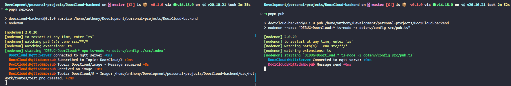

# Doorcloud Backend

## Prerequisites

To have installed the following:

- [Node.js](https://nodejs.org/) `22.20.0` (see `.nvmrc`)
- [pnpm](https://pnpm.io/) `10.30.1` via Corepack

A `.env` file with the correct variables specified in the `.env.example` file.

Required environment variables are validated on startup: `MQTT_USER`,
`MQTT_PASS`, `MQTT_HOST`, `MQTT_PORT`, `SUPABASE_URL`, `SUPABASE_KEY`, and
`MODELS_CDN_URL`. MQTT is required: broker connection or subscription failures
are treated as fatal startup errors. `OPENWA_BASE_URL` defaults to
`http://localhost:2785` and `OPENWA_SESSION_ID` defaults to `main`;
`OPENWA_API_KEY` and `OPENWA_CHAT_ID` are required only when using OpenWA setup
or WhatsApp sends. `OPENWA_CHAT_ID` should be the WhatsApp chat ID for the
destination number, e.g. `51999999999@c.us`. `PORT` defaults to `1996`,
`NODE_ENV` defaults to `development`, `MQTT_PROTOCOL` defaults to `mqtts`, and
MQTT lifecycle settings default to clean sessions, 60s keepalive, 1s reconnect
period, 30s connect timeout, and QoS 0 subscriptions.

`CORS_ORIGINS` is optional and accepts a comma-separated list of allowed origins
(e.g., `http://localhost:3000,https://app.doorcloud.com`). When not set, CORS
allows all origins (backward compatible). When set, only the specified origins
are allowed.

### Face Recognition Models (Required)

**⚠️ HARD GATE:** The application will not start if the face recognition models are not downloaded.

Download the required ONNX models (~500MB) before running the application:

```bash
pnpm models:download
```

Or run the script directly:

```bash
./scripts/download-models.sh
```

This script downloads:
- InsightFace buffalo_l/m/s (512D embeddings, 106 landmarks)
- MediaPipe FaceMesh (468 landmarks)
- dlib face recognition (128D embeddings)

Models are saved to the `models/` directory (gitignored). The application validates model existence on startup and will fail with a clear error message if any required model is missing.

## Setup

Use the pinned runtime and package manager before installing dependencies:

```bash
nvm use
corepack enable
corepack prepare pnpm@10.30.1 --activate
pnpm install --frozen-lockfile
pnpm models:download  # Download face recognition models (~500MB)
pnpm test:local
```

The repository enforces this baseline through `.nvmrc`, `package.json`, and
`pnpm-workspace.yaml`. Use `nvm use` before pnpm commands so `engineStrict`
does not reject the install.

## Docker

The image uses the current Node 22 Alpine 3.23 line, upgrades Alpine packages at
build time, and keeps pnpm pinned to the project baseline:

```bash
docker build -t doorcloud-backend .
docker run --env-file .env -p 1996:1996 doorcloud-backend
```

## Local Mosquitto broker

The local broker runs with authentication and ACLs. Generate the password file
outside git before starting Compose:

```bash
./scripts/mosquitto/create-password-file.sh
docker compose up -d mosquitto
```

Default local credentials generated by the script:

```dotenv
MQTT_USER=doorcloud-backend
MQTT_PASS=doorcloud-backend-local
MQTT_HOST=localhost
MQTT_PROTOCOL=mqtt
MQTT_PORT=1883
MQTT_CLEAN=true
MQTT_KEEPALIVE=60
MQTT_RECONNECT_PERIOD=1000
MQTT_CONNECT_TIMEOUT=30000
MQTT_QOS=0
```

Preferred MQTT topics are versioned:

- `doorcloud/v1/photo/send` receives JSON photo payloads:
  `{"userId":"123","format":"jpeg","photo":"data:image/jpeg;base64,..."}`
- `doorcloud/v1/photo/metrics` receives JSON metrics payloads:
  `{"timestampSent": 1730000000000}`

**Note:** Legacy `DoorCloud/photo/#` topics are no longer supported. All
publishers must use the versioned `doorcloud/v1/photo/*` topics.

Use `MOSQUITTO_BACKEND_PASSWORD` and `MOSQUITTO_DEVICE_PASSWORD` to generate
different local passwords. The generated `infra/mosquitto/passwordfile` is
ignored and must not be committed.

Run the Mosquitto-backed integration suite with Docker:

```bash
pnpm test:mqtt
```

`test:mqtt` starts Mosquitto, waits for the broker healthcheck, runs the MQTT
integration tests, and then removes the Compose volumes. The integration script
uses host port `1884` by default to avoid conflicts with an already-running
local broker; override it with `MOSQUITTO_PORT=<port> pnpm test:mqtt`.

## OpenWA WhatsApp sign-in

DoorCloud sends WhatsApp text and image messages through an OpenWA gateway. To
sign in the configured OpenWA session from a terminal, set `OPENWA_BASE_URL`,
`OPENWA_API_KEY`, and `OPENWA_SESSION_ID` in `.env`, then run:

```bash
pnpm openwa:qr
```

The script creates the session if it does not exist, starts it, waits for the QR
code, and saves it to `.openwa/qr.png` by default. Scan that QR with the
WhatsApp account that should send DoorCloud notifications. Use
`OPENWA_QR_PATH=path/to/qr.png pnpm openwa:qr` to choose another output path.

The API key must be able to create/start sessions and read QR codes. If OpenWA
creates a different session ID, the script prints it; copy that value back into
`OPENWA_SESSION_ID` before running DoorCloud.

For a local browser setup flow, start DoorCloud and open:

```text
http://localhost:1996/setup
```

The setup page can save OpenWA config into `.env`, refresh OpenWA status, start
the session, render the sign-in QR, and send a text/image test to
`OPENWA_CHAT_ID`.

Before `pnpm service` starts the backend, the `preservice` script tries to fill an empty
`OPENWA_API_KEY` by reading `/app/data/.api-key` from a running Docker Compose
OpenWA service. It tries `OPENWA_COMPOSE_SERVICE`, then `openwa`, then
`openwa-api`. To run the sync manually:

```bash
pnpm openwa:sync-api-key
```

If OpenWA is managed by a separate Compose project, set
`OPENWA_COMPOSE_SERVICE` to the service name that exposes `/app/data/.api-key`,
or paste the key in `/setup`.

## Testing

At this point, we only can test receiving and sending messages manually or using the Vitest unit tests.

When testing manually, if everything went ok, the image [`basic_pub_sub_testing.png`](basic_pub_sub_test.png) will be copied to the folder `./src/network/routes/` with the name `test.png`.

### Receiving

To subscribe and receive messages in the default topic `DoorCloud` we have to run the following command:

```bash
pnpm service
```

We will get an output as follows:

```bash
> doorcloud-backend@0.1.0 service /home/anthony/Development/personal-projects/DoorCloud-backend
> nodemon

[nodemon] 2.0.20
[nodemon] to restart at any time, enter `rs`
[nodemon] watching path(s): .env src/**/*
[nodemon] watching extensions: ts
[nodemon] starting `DEBUG=DoorCloud:* tsx -r dotenv/config ./src/index.ts`
[04:34:52 UTC] INFO: Server listening at http://127.0.0.1:1996
[04:34:52 UTC] INFO: Server listening at http://[::1]:1996
[04:34:53 UTC] INFO: Connected to mqtt server
[04:34:53 UTC] INFO: DoorCloud:Mqtt:demo:sub
[04:34:59 UTC] INFO: Received an image
[04:34:59 UTC] INFO: Topic: DoorCloud/# - Image: /home/anthony/Development/personal-projects/DoorCloud-backend/src/network/mqtt/routes/test.png created.
```

Once we receive a new message it will be displayed immediately after.

### Sending

To send a message to the `DoorCloud/test` topic we have to run the following command:

```bash
pnpm pub
```

We will get the following out put:

```bash
> doorcloud-backend@0.1.0 pub /home/anthony/Development/personal-projects/DoorCloud-backend
> nodemon --exec "DEBUG=DoorCloud:* tsx -r dotenv/config src/pub.ts"

[nodemon] 2.0.20
[nodemon] to restart at any time, enter `rs`
[nodemon] watching path(s): .env src/**/*
[nodemon] watching extensions: ts
[nodemon] starting `DEBUG=DoorCloud:* tsx -r dotenv/config src/pub.ts`
  DoorCloud:Mqtt:Server Connected to mqtt server +0ms
  DoorCloud:Mqtt:demo:pub Message send +0ms
```

Finally, we may have an output as follows:



## Linting and Formatting

This project uses [Biome](https://biomejs.dev/) for linting and formatting, replacing ESLint and Prettier for better performance and TypeScript 7 support.

```bash
# Check for lint errors
pnpm lint

# Auto-fix lint errors and format
pnpm lint:fix

# Format only (no lint checks)
pnpm format
```

Biome configuration is in `biome.json`. The tool provides:
- Fast linting and formatting (10-50x faster than ESLint + Prettier)
- Native TypeScript 7 support
- Single configuration file
- Consistent code style across the project

## Release

This project uses `commit-and-tag-version` for automated changelog generation and
version management following [Conventional Commits](https://www.conventionalcommits.org/).

To generate a release:

```bash
pnpm release
```

This will:
- Analyze commits since the last tag
- Update `CHANGELOG.md` with new entries
- Bump the version in `package.json`

The tool is configured to skip automatic git commits and tags, so you can review
changes before committing manually.

**Commit message format:**
- `feat:` → minor version bump
- `fix:` → patch version bump
- `BREAKING CHANGE:` in footer → major version bump
