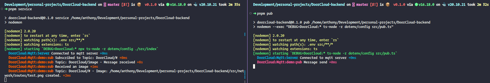

# Doorcloud Backend

## Development Conventions

**No emojis**: Never use emojis in code, comments, commit messages, documentation, or any other project artifacts. Use plain text only.

## Prerequisites

To have installed the following:

- [Node.js](https://nodejs.org/) `22.20.0` (see `.nvmrc`)
- [pnpm](https://pnpm.io/) `10.30.1` via Corepack

A `.env` file with the correct variables specified in the `.env.example` file.

Required environment variables are validated on startup: `MQTT_USER`,
`MQTT_PASS`, `MQTT_HOST`, `MQTT_PORT`, `PHOTOS_DIR`, `PHOTOS_BASE_URL`,
`USER_NAME`, and `MODELS_CDN_URL`. MQTT is required:
broker connection or subscription failures are treated as fatal startup
errors. `OPENWA_BASE_URL` defaults to
`http://localhost:2785` and `OPENWA_SESSION_ID` defaults to `main`;
`OPENWA_API_KEY` and `OPENWA_CHAT_ID` are required only when using OpenWA setup
or WhatsApp sends. `OPENWA_CHAT_ID` should be the WhatsApp chat ID for the
destination number, e.g. `51999999999@c.us`. `PORT` defaults to `1996`,
`NODE_ENV` defaults to `development`, `MQTT_PROTOCOL` defaults to `mqtts`, and
MQTT lifecycle settings default to clean sessions, 60s keepalive, 1s reconnect
period, 30s connect timeout, and QoS 0 subscriptions.

When the OpenWA container has to fetch photo URLs from the host (e.g.
`PHOTOS_BASE_URL` uses the compose network gateway, a private IP), its SSRF
guard rejects them with `400 Destination address is not allowed`. Allowlist the
host via `OPENWA_SSRF_ALLOWED_HOSTS` (comma-separated) in `.env`; the compose
file forwards it to OpenWA as `SSRF_ALLOWED_HOSTS`.

`CORS_ORIGINS` is optional and accepts a comma-separated list of allowed origins
(e.g., `http://localhost:3000,https://app.doorcloud.com`). When not set, CORS
allows all origins (backward compatible). When set, only the specified origins
are allowed.

### Face Recognition Models (Required)

**⚠️ HARD GATE:** The application will not start if the face recognition models are not downloaded.

Download the required ONNX models (~500MB) before running the application:

```bash
pnpm models:download
```

Or run the script directly:

```bash
./scripts/download-models.sh
```

This script downloads:
- InsightFace buffalo_l/m/s (512D embeddings, 106 landmarks)
- MediaPipe FaceMesh (468 landmarks)
- dlib face recognition (128D embeddings)

Models are saved to the `models/` directory (gitignored). The application validates model existence on startup and will fail with a clear error message if any required model is missing.

### Face Verification Pipeline (Buffalo-S, ONNX-only)

Photo verification runs through the **Buffalo-S ONNX pipeline** in production: SCRFD `det_500m` detects the face and returns 5 landmarks, the aligned crop is warped and embedded by `w600k_mbf`, and the probe embedding is compared against the stored user photos (sequential, capped at `FACE_VERIFY_MAX_PHOTOS`, default 10).

The verification threshold is derived from the real production pipeline on the BFW pair dataset (920,936 pairs) at a target FAR of 1e-4 — see `docs/benchmark-analysis.md` section 4.7. The default `FACE_VERIFY_THRESHOLD` is 0.3435; do not substitute the older center-crop benchmark value (0.3719), which does not correspond to this pipeline.

Optional environment variables (see `.env.example`):

- `FACE_VERIFY_THRESHOLD` — cosine similarity threshold (default `0.3435`)
- `FACE_VERIFY_MAX_PHOTOS` — max stored photos compared per verification (default `10`)

**Rollback**: the previous `@vladmandic/human` implementation is preserved in the git history. To roll back the face recognition migration, revert the migration commits (`lib/human` was left untouched). There is no runtime mode flag; the pipeline is ONNX-only.

## Setup

Use the pinned runtime and package manager before installing dependencies:

```bash
nvm use
corepack enable
corepack prepare pnpm@10.30.1 --activate
pnpm install --frozen-lockfile
pnpm models:download  # Download face recognition models (~500MB)
pnpm test:local
```

The repository enforces this baseline through `.nvmrc`, `package.json`, and
`pnpm-workspace.yaml`. Use `nvm use` before pnpm commands so `engineStrict`
does not reject the install.

## Photo storage and backup

Photos are stored locally on disk instead of a cloud bucket. Uploads are
written under `PHOTOS_DIR` and served through HMAC-signed URLs that expire
(`GET /photos/:signature/:expiresAt/*`); the base URL clients use is
`PHOTOS_BASE_URL` (default `http://localhost:1996/photos`). The URL lifetime
is `PHOTO_URL_TTL_MS` (default 300000 ms = 5 minutes) and must cover the
window in which OpenWA fetches the media; see `PHOTOS_BASE_URL and Docker`
below.

**Known people are folders.** Every child folder of `PHOTOS_DIR` is one known
person and the folder name IS the identity: create `PHOTOS_DIR/Bryan Ramos/`,
`PHOTOS_DIR/Henry Cordero/`, `PHOTOS_DIR/Diana Kevans/`, ... and drop their
reference photos inside (files may be named anything). Door verification
always compares the probe against ALL person folders; on a match the
WhatsApp message says who is at the door (e.g. `Hey, Bryan Ramos is here!`)
and the door photo is stored back into that person's folder to reinforce
future matches. Unmatched photos are stored in `PHOTOS_DIR/{USER_NAME}` with
a numeric-timestamp prefix so they are never re-used as references. Photos
can also be uploaded via `POST /api/user/upload` (stored under the configured
`USER_NAME` folder). WhatsApp sends go to `OPENWA_CHAT_ID` (settable from the
`/setup` page); `USER_PHONE` is optional and only used as a legacy destination
hint. The `POST /api/user` create route is no longer exposed.

### PHOTOS_BASE_URL and Docker

`PHOTOS_BASE_URL` must be reachable from the consumers of photo URLs: the
backend itself (`verify()` fetches each URL in-process) and OpenWA
(`send-image`). OpenWA runs on the same host by default
(`http://localhost:2785`); if OpenWA runs in Docker, `localhost` inside the
container does not resolve to the backend, so `PHOTOS_BASE_URL` must be the
host's reachable address (e.g. `http://192.168.1.10:1996/photos`).

### Backup CLI

`pnpm door-cloud backup` (alias: `pnpm photos:backup`) copies `PHOTOS_DIR` to
a local folder or a signed webhook endpoint. The CLI loads `.env` via dotenv,
so `PHOTOS_DIR`, `BACKUP_DEST`, and `BACKUP_SECRET` can come from the
environment file:

```bash
# Local folder copy (preserves the relative layout, overwrites existing files)
pnpm door-cloud backup --dest /var/backups/doorcloud-photos

# Signed webhook push (per-file POST with an HMAC-SHA256 signature)
pnpm door-cloud backup --dest https://example.com/hooks/doorcloud --secret webhook-secret

# Preview what would happen without writing or sending anything
pnpm door-cloud backup --dry-run
```

Flags and env fallbacks:

| Setting | Flag | Env fallback |
|---------|------|--------------|
| Destination (folder or webhook URL) | `--dest` | `BACKUP_DEST` |
| Webhook signing secret | `--secret` | `BACKUP_SECRET` |
| Dry run | `--dry-run` | — |

Webhook pushes POST each file's raw bytes to `<dest>?path=<relative-path>`
with an `X-DoorCloud-Signature` header (lowercase hex HMAC-SHA256 covering
`{timestamp}.{body}` with the configured secret) and an
`X-DoorCloud-Timestamp` header (Unix milliseconds). Because the signature
covers the timestamp, an on-path attacker cannot rewrite the timestamp
without invalidating the signature. Network errors and timeouts are retried
with exponential backoff (500ms, 1s, 2s... up to 3 retries per file, 30s
fetch timeout); non-2xx responses fail immediately. The CLI exits `0` when
every file succeeds and `1` when any file fails.

#### Installing `door-cloud` as a global CLI

The package exposes the `door-cloud` command through its `bin` field. The
entry point is `bin/door-cloud.ts`, which runs under `tsx`; since `tsx` is a
devDependency of this project (not a runtime dependency of the installed
global shim), you need `tsx` available on the global `PATH` once:

```bash
pnpm add --global tsx
```

Then link the package globally from the repo root:

```bash
pnpm link --global
```

After that the command works from anywhere, loading `.env` relative to the
current working directory:

```bash
door-cloud --help
door-cloud backup --dest /var/backups/doorcloud-photos
```

Notes:

- The global `door-cloud` shim executes the project-local `tsx`; without the
  global `tsx` install the shim fails with `exec: tsx: not found`.
- Re-run `pnpm link --global` after the bin entry changes (e.g. the file the
  `bin` field points to), so the generated shim tracks the new path.
- Inside the repo you never need the global install: `pnpm door-cloud backup`
  resolves the local `tsx` automatically.
- The CLI does not require the backend to be running; it reads `PHOTOS_DIR`
  directly from disk. For webhook backups set `BACKUP_SECRET` (or pass
  `--secret`).
- `door-cloud photos:send` publishes with the MQTT device credentials
  (`MQTT_DEVICE_USER`/`MQTT_DEVICE_PASS`), not the backend credentials: the
  mosquitto ACL only allows the device user to write
  `doorcloud/v1/photo/send`. Publishing as the backend user fails silently
  because the QoS 0 publish is dropped by the broker.

### Rollback

The Supabase implementation is preserved in git history. To roll back, revert
the migration commits and restore the `SUPABASE_*` variables in `.env`.
Photos already on disk can be re-uploaded to the bucket via the backup CLI.

## Docker

The project runs as a single production container: the Fastify backend serves
the Preact SPA (`apps/web/dist`) **same-origin** from `/`, `/setup` and
`/assets/*`, so no separate web/nginx container is needed. The image is built
through the **Turborepo** task graph (shared -> backend -> web).

The image uses `node:22-bookworm-slim` (glibc). Onnxruntime-node ships glibc-only
prebuilt binaries, so an Alpine/musl base cannot `dlopen` it at boot. It is NOT
an Alpine image.

### Compose (recommended)

The root `docker-compose.yaml` defines a `doorcloud` service (image `doorcloud`)
beside `mosquitto` and `openwa` on one network. The
backend connects to the broker via `MQTT_HOST=mosquitto` (plaintext
`MQTT_PROTOCOL=mqtt`), serves the SPA, exposes `GET /healthz` for liveness, and
is wired to a HEALTHCHECK with `restart: unless-stopped`.

```bash
# 1. environment (required by env.ts; see "Docker env handoff" below). The
#    template lives at apps/backend/.env.example — copy values you need into a
#    root .env consumed by compose's env_file.
cp apps/backend/.env.example .env
# 2. run the stack
docker compose up -d
# 3. verify
curl http://localhost:1996/healthz   # -> {"status":"ok"}
curl http://localhost:1996/          # -> SPA HTML (200)
```

Persistent state lives on named volumes:

- `PHOTOS_DIR` (default `/data/photos`) -> volume `doorcloud-photos`
- SQLite state -> `STATE_DB_PATH=/data/state/app-state.db` -> volume
  `doorcloud-state` (so `last_message_at` survives recreation)
- ONNX models live in the named volume `doorcloud-models` mounted at
  `MODELS_DIR=/app/apps/backend/models`. The entrypoint provisions them on
  first boot (downloads the production set, ~130MB); models are NEVER baked
  into the image, so they stay swappable without a rebuild.

Graceful shutdown: the backend handles `SIGTERM` — it drains in-flight work
(MQTT close -> face-recognition shutdown -> HTTP close) within a 10s grace
period, then exits 0. `docker stop` triggers this path.

### Build the image manually

```bash
docker compose build doorcloud
# or directly
docker build -t doorcloud .
```

### Docker env handoff

`env.ts` validates the environment at boot; the container fails fast if
anything required is missing. Required in production:

```dotenv
MQTT_HOST=mosquitto
MQTT_PROTOCOL=mqtt          # env.ts defaults to mqtts (TLS); use mqtt for the compose broker
MQTT_PORT=1883
MQTT_USER=<backend broker user>
MQTT_PASS=<backend broker password>
PHOTOS_DIR=/data/photos
PHOTOS_BASE_URL=http://<host>:1996/photos
PHOTOS_URL_SECRET=replace-with-a-32-char-random-string  # >= 16 chars, not a placeholder
USER_NAME=<owner display name>
MODELS_CDN_URL=<cdn url the models were downloaded from>
CORS_ORIGINS=<comma-separated allowed origins>   # required when NODE_ENV=production
```

Optional, depending on feature use:

```dotenv
USER_PHONE=51999999999@c.us
OPENWA_BASE_URL=http://openwa:2785
OPENWA_API_KEY=<your key>
OPENWA_SESSION_ID=main
OPENWA_CHAT_ID=51999999999@c.us
SETUP_TOKEN=<token for /admin/*>
WEB_AUTH_USER=<basic auth user>        # optional: Basic auth for the SPA; /healthz and /photos/* stay exempt
WEB_AUTH_PASS=<basic auth password>
STATE_DB_PATH=/data/state/app-state.db
HOST=0.0.0.0
PORT=1996
```

If `CORS_ORIGINS` is missing while `NODE_ENV=production`, `env.ts` rejects the
config at boot; supply it via `environment` or `env_file`. The Compose
`doorcloud` service already sets `MQTT_HOST=mosquitto` and
`MQTT_PROTOCOL=mqtt`; keep `.env` as the source of truth for secrets.

## Local Mosquitto broker

The local broker runs with authentication and ACLs. Generate the password file
outside git before starting Compose:

```bash
./scripts/mosquitto/create-password-file.sh
docker compose up -d mosquitto
```

Default local credentials generated by the script:

```dotenv
MQTT_USER=doorcloud-backend
MQTT_PASS=doorcloud-backend-local
MQTT_DEVICE_USER=doorcloud-device
MQTT_DEVICE_PASS=doorcloud-device-local
MQTT_HOST=localhost
MQTT_PROTOCOL=mqtt
MQTT_PORT=1883
MQTT_CLEAN=true
MQTT_KEEPALIVE=60
MQTT_RECONNECT_PERIOD=1000
MQTT_CONNECT_TIMEOUT=30000
MQTT_QOS=0
```

`MQTT_USER`/`MQTT_PASS` are the backend server credentials. The
`door-cloud photos:send` CLI must use the device credentials
(`MQTT_DEVICE_USER`/`MQTT_DEVICE_PASS`): the mosquitto ACL only allows the
device user to write `doorcloud/v1/photo/send`, while the backend user may
only read it. Defaults match `create-password-file.sh`; override the device
credentials in `.env` if you generated a custom device password.

Preferred MQTT topics are versioned:

- `doorcloud/v1/photo/send` receives JSON photo payloads:
  `{"format":"jpeg","photo":"data:image/jpeg;base64,..."}`
- `doorcloud/v1/photo/metrics` receives JSON metrics payloads:
  `{"timestampSent": 1730000000000}`

**Note:** Legacy `DoorCloud/photo/#` topics are no longer supported. All
publishers must use the versioned `doorcloud/v1/photo/*` topics.

Use `MOSQUITTO_BACKEND_PASSWORD` and `MOSQUITTO_DEVICE_PASSWORD` to generate
different local passwords. The generated `infra/mosquitto/passwordfile` is
ignored and must not be committed.

Run the Mosquitto-backed integration suite with Docker:

```bash
pnpm test:mqtt
```

`test:mqtt` starts Mosquitto, waits for the broker healthcheck, runs the MQTT
integration tests, and then removes the Compose volumes. The integration script
uses host port `1884` by default to avoid conflicts with an already-running
local broker; override it with `MOSQUITTO_PORT=<port> pnpm test:mqtt`.

## OpenWA WhatsApp sign-in

DoorCloud sends WhatsApp text and image messages through an OpenWA gateway. To
sign in the configured OpenWA session from a terminal, set `OPENWA_BASE_URL`,
`OPENWA_API_KEY`, and `OPENWA_SESSION_ID` in `.env`, then run:

```bash
pnpm openwa:qr
```

The script creates the session if it does not exist, starts it, waits for the QR
code, and saves it to `.openwa/qr.png` by default. Scan that QR with the
WhatsApp account that should send DoorCloud notifications. Use
`OPENWA_QR_PATH=path/to/qr.png pnpm openwa:qr` to choose another output path.

The API key must be able to create/start sessions and read QR codes. If OpenWA
creates a different session ID, the script prints it; copy that value back into
`OPENWA_SESSION_ID` before running DoorCloud.

For a local browser setup flow, start DoorCloud and open:

```text
http://localhost:1996/setup
```

The setup page can save OpenWA config into `.env`, refresh OpenWA status, start
the session, render the sign-in QR, and send a text/image test to
`OPENWA_CHAT_ID`. The correct order on the page is: **Start session** first,
then **Load QR** — requesting the QR before the session is running returns a
400 (`Session is not started`), and a missing broker/gateway shows as
`ECONNREFUSED` in the setup logs.

Before `pnpm service` starts the backend, the `preservice` script:
1. starts `mosquitto` and `openwa` with Docker Compose when they are not
   already running, then
2. tries to fill an empty `OPENWA_API_KEY` by reading `/app/data/.api-key`
   from a running Docker Compose OpenWA service. It tries
   `OPENWA_COMPOSE_SERVICE`, then `openwa`, then `openwa-api`.

To run these steps manually:

```bash
node scripts/ensure-services.mjs   # docker compose up -d mosquitto openwa when down
pnpm openwa:sync-api-key           # fill OPENWA_API_KEY from the OpenWA container
```

If OpenWA is managed by a separate Compose project, set
`OPENWA_COMPOSE_SERVICE` to the service name that exposes `/app/data/.api-key`,
or paste the key in `/setup`.

## Monorepo web app

The repository is a pnpm workspace: the Fastify backend in `apps/backend`
(`@doorcloud/backend`), the config web app in `apps/web` (`@doorcloud/web`,
Preact + hash routing), and the shared zod DTOs in `packages/shared`
(`@doorcloud/shared`, built `dist`).

The SPA is served same-origin by the backend and replaces the old
`renderSetupHtml` page:

- `/` and `/setup` serve `apps/web/dist` through `@fastify/static`; the
  `/admin/*` and `/setup/*` API routes always take precedence. Set `WEB_DIST`
  to serve the build from another folder (default `apps/web/dist`).
- `#/setup` drives the OpenWA pairing flow (3s poll, auto-QR, failure caps).
- `#/admin` is the photo admin (Bearer `SETUP_TOKEN` in localStorage): person
  CRUD, per-person photos, and the `unidentified/` tray (promote/remove).

`pnpm install` at the repo root wires the workspace; `pnpm -r test:local`,
`pnpm typecheck` and `pnpm lint` run across every package. `@doorcloud/shared`
ships its built `dist`, so a fresh checkout must `pnpm --filter
@doorcloud/shared build` before building the backend or web consumers.

## Benchmark and Demographic Bias Analysis

The repository includes a reproducible benchmark and demographic bias analysis pipeline for the face recognition models. See [`docs/benchmark-analysis.md`](docs/benchmark-analysis.md) for the full thesis-like report (methodology, results, figures, LaTeX tables, and Appendix A with per-model bias tables).

### Pipeline

```bash
pnpm benchmark:embeddings        # Generate BFW embeddings for all 5 models (takes hours, uses metrics/embeddings/)
pnpm benchmark:analyze           # Compute bias metrics and update Appendix A in docs/benchmark-analysis.md
pnpm benchmark:plots             # Generate bias figures (metrics/figures/) and LaTeX tables (metrics/tables/)
pnpm benchmark:plots-benchmark   # Regenerate benchmark figures (AUC, ROC, latency) at 300 DPI
```

### Requirements

- **BFW dataset** must exist at `datasets/tmp/BFW-Release/bfw-faces-cropped/jrobby/bfw/bfw-cropped-aligned` (downloaded via `scripts/download-datasets.sh`)
- **Python env** (`.venv`) with `numpy`, `pandas`, `matplotlib`, `seaborn` for the plotting scripts
- **Embeddings** are runtime data: generated by `benchmark:embeddings` and ignored by git (`metrics/embeddings/`)

### Reproducibility

All sampling in the bias analysis uses a fixed seed (mulberry32, seed 42), so repeated runs produce identical numbers. The analysis script (`scripts/analyze-bias.ts`) regenerates Appendix A in-place in `docs/benchmark-analysis.md` between the `## Appendix A` and `## References` markers; the rest of the document is hand-authored and preserved.

## Testing

At this point, we only can test receiving and sending messages manually or using the Vitest unit tests.

When testing manually, if everything went ok, the image [`basic_pub_sub_testing.png`](basic_pub_sub_test.png) will be copied to the folder `./src/network/routes/` with the name `test.png`.

### Receiving

To subscribe and receive messages in the default topic `DoorCloud` we have to run the following command:

```bash
pnpm service
```

We will get an output as follows:

```bash
> doorcloud-backend@0.1.0 service /home/anthony/Development/personal-projects/DoorCloud-backend
> nodemon

[nodemon] 2.0.20
[nodemon] to restart at any time, enter `rs`
[nodemon] watching path(s): .env src/**/*
[nodemon] watching extensions: ts
[nodemon] starting `DEBUG=DoorCloud:* tsx -r dotenv/config ./src/index.ts`
[04:34:52 UTC] INFO: Server listening at http://127.0.0.1:1996
[04:34:52 UTC] INFO: Server listening at http://[::1]:1996
[04:34:53 UTC] INFO: Connected to mqtt server
[04:34:53 UTC] INFO: DoorCloud:Mqtt:demo:sub
[04:34:59 UTC] INFO: Received an image
[04:34:59 UTC] INFO: Topic: DoorCloud/# - Image: /home/anthony/Development/personal-projects/DoorCloud-backend/src/network/mqtt/routes/test.png created.
```

Once we receive a new message it will be displayed immediately after.

### Sending

To send a message to the `DoorCloud/test` topic we have to run the following command:

```bash
pnpm pub
```

We will get the following out put:

```bash
> doorcloud-backend@0.1.0 pub /home/anthony/Development/personal-projects/DoorCloud-backend
> nodemon --exec "DEBUG=DoorCloud:* tsx -r dotenv/config src/pub.ts"

[nodemon] 2.0.20
[nodemon] to restart at any time, enter `rs`
[nodemon] watching path(s): .env src/**/*
[nodemon] watching extensions: ts
[nodemon] starting `DEBUG=DoorCloud:* tsx -r dotenv/config src/pub.ts`
  DoorCloud:Mqtt:Server Connected to mqtt server +0ms
  DoorCloud:Mqtt:demo:pub Message send +0ms
```

Finally, we may have an output as follows:



## Linting and Formatting

This project uses [Biome](https://biomejs.dev/) for linting and formatting, replacing ESLint and Prettier for better performance and TypeScript 7 support.

```bash
# Check for lint errors
pnpm lint

# Auto-fix lint errors and format
pnpm lint:fix

# Format only (no lint checks)
pnpm format
```

Biome configuration is in `biome.json`. The tool provides:
- Fast linting and formatting (10-50x faster than ESLint + Prettier)
- Native TypeScript 7 support
- Single configuration file
- Consistent code style across the project

## Release

This project uses `commit-and-tag-version` for automated changelog generation and
version management following [Conventional Commits](https://www.conventionalcommits.org/).

To generate a release:

```bash
pnpm release
```

This will:
- Analyze commits since the last tag
- Update `CHANGELOG.md` with new entries
- Bump the version in `package.json`

The tool is configured to skip automatic git commits and tags, so you can review
changes before committing manually.

**Commit message format:**
- `feat:` → minor version bump
- `fix:` → patch version bump
- `BREAKING CHANGE:` in footer → major version bump
