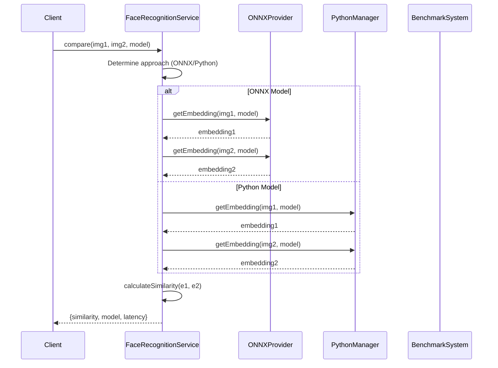

# Face Recognition Benchmarking System - Design Document

## Overview

Sistema híbrido de benchmarking para modelos de face recognition que combina ONNX Runtime en Node.js (para modelos compatibles) y Python child processes (para modelos sin soporte ONNX), con una API unificada que abstrae el approach.

## Architecture

### High-Level Architecture

```
┌─────────────────────────────────────────────────────────┐
│              DoorCloud Backend (Node.js)                │
│                                                         │
│  ┌──────────────────────────────────────────────────┐  │
│  │      FaceRecognitionService (Unified API)        │  │
│  │  - compare(image1, image2, modelName)            │  │
│  │  - getEmbedding(image, modelName)                │  │
│  │  - runBenchmark(dataset, models[])               │  │
│  │  - getLeaderboard(options)                       │  │
│  └──────────────────────────────────────────────────┘  │
│                          │                              │
│              ┌───────────┴───────────┐                 │
│              │                       │                 │
│    ┌─────────▼─────────┐   ┌────────▼────────┐        │
│    │  ONNXProvider     │   │ PythonManager   │        │
│    │  (Direct)         │   │ (Child Process) │        │
│    │                   │   │                 │        │
│    │  • InsightFace    │   │  • AdaFace      │        │
│    │  • MediaPipe      │   │  • MagFace      │        │
│    │  • dlib (parcial) │   │  • OpenFace     │        │
│    │                   │   │  • Custom       │        │
│    └───────────────────┘   └─────────────────┘        │
│              │                       │                 │
│              └───────────┬───────────┘                 │
│                          │                             │
│              ┌───────────▼───────────┐                 │
│              │   BenchmarkSystem     │                 │
│              │  - Dataset loading    │                 │
│              │  - Metrics calc       │                 │
│              │  - Results storage    │                 │
│              └───────────────────────┘                 │
└─────────────────────────────────────────────────────────┘
```

### Component Interaction



## Data Flow

### Face Comparison Flow

```
Input Images (Buffer/base64/path)
    ↓
Image Preprocessing (resize, normalize)
    ↓
Model Selection (ONNX vs Python)
    ↓
┌─────────────────┬─────────────────┐
│   ONNX Path     │  Python Path    │
│                 │                 │
│ ONNX Runtime    │ Child Process   │
│ Inference       │ IPC (JSON)      │
│ ~20ms           │ ~50ms           │
└─────────────────┴─────────────────┘
    ↓
Embedding (Float32Array)
    ↓
Similarity Calculation (cosine)
    ↓
Result {similarity, model, latency}
```

### Benchmark Execution Flow

```
Benchmark Request (dataset, models[])
    ↓
Dataset Loading (LFW, CFP-FP, AgeDB-30)
    ↓
For each model:
    ↓
    Load Model (ONNX/Python)
    ↓
    For each pair:
        ↓
        Compare images
        ↓
        Store {similarity, latency, label}
    ↓
    Calculate Metrics (TAR@FAR, AUC, EER)
    ↓
    Store Results (SQLite)
    ↓
Generate Leaderboard
    ↓
Return Results
```

## Technical Decisions

### Decision 1: ONNX Runtime vs Python

**Context**: Necesitamos ejecutar modelos de face recognition en Node.js.

**Options**:
1. **ONNX Runtime (Node.js)**: Ejecutar modelos ONNX directamente
2. **Python Child Process**: Ejecutar modelos PyTorch via IPC
3. **HTTP API**: Servicio Python separado con REST API
4. **gRPC**: Servicio Python con gRPC

**Decision**: **Híbrido (ONNX + Python Child Process)**

**Rationale**:
- ONNX Runtime es 10-20ms más rápido que Python (sin IPC overhead)
- No todos los modelos tienen soporte ONNX
- Child process es más simple que HTTP/gRPC para IPC local
- Mantiene todo en un solo servicio (no dos APIs separadas)

**Trade-offs**:
- ✅ Performance óptima para modelos ONNX
- ✅ Acceso a todos los modelos PyTorch via Python
- ⚠️ Complejidad de mantener dos runtimes
- ⚠️ Python child process agrega overhead

### Decision 2: IPC Protocol (stdin/stdout vs HTTP vs gRPC)

**Context**: Necesitamos comunicar Node.js con Python.

**Options**:
1. **stdin/stdout JSON**: Simple, sin dependencias
2. **HTTP REST**: Estándar, pero overhead de red
3. **gRPC**: Performance, pero complejidad
4. **Unix Domain Sockets**: Rápido, pero platform-specific

**Decision**: **stdin/stdout JSON**

**Rationale**:
- Simple de implementar
- Sin dependencias adicionales
- Suficiente performance para benchmarking
- Fácil de debuggear

**Trade-offs**:
- ✅ Simple, zero-dependency
- ✅ Fácil de implementar y debuggear
- ⚠️ Overhead de serialización JSON
- ⚠️ No apto para high-throughput (pero OK para benchmarking)

### Decision 3: Model Loading Strategy

**Context**: ¿Cuándo cargar modelos en memoria?

**Options**:
1. **Eager loading**: Cargar todos al iniciar
2. **Lazy loading**: Cargar bajo demanda
3. **LRU cache**: Cargar/descargar según uso

**Decision**: **Lazy loading con cache**

**Rationale**:
- 8-10 modelos = 2-3GB RAM (mucho para cargar todos)
- Lazy loading reduce memoria inicial
- Cache evita recargar modelos frecuentes

**Trade-offs**:
- ✅ Menor uso de memoria inicial
- ✅ Flexibilidad para agregar modelos
- ⚠️ Primera inference es más lenta
- ⚠️ Complejidad de gestión de cache

### Decision 4: Benchmark Storage

**Context**: ¿Dónde guardar resultados de benchmarks?

**Options**:
1. **SQLite**: File-based, zero-config
2. **PostgreSQL**: Robusto, pero requiere server
3. **JSON files**: Simple, pero difícil de consultar
4. **In-memory**: Rápido, pero no persistente

**Decision**: **SQLite**

**Rationale**:
- Zero external dependencies
- File-based (fácil backup)
- SQL para queries complejas
- Suficiente para benchmarking (no high-throughput)

**Trade-offs**:
- ✅ Zero dependencies
- ✅ Fácil de migrar (archivo único)
- ⚠️ No concurrent writes (pero OK para benchmarks)
- ⚠️ Limitado a single-node

## Component Design

### ONNXProvider

**Responsibilities**:
- Cargar modelos ONNX
- Preprocesar imágenes
- Ejecutar inference
- Trackear métricas

**Key Methods**:
```typescript
class ONNXProvider {
  async loadModel(name: string, path: string): Promise<void>
  async getEmbedding(image: Buffer, model: string): Promise<Float32Array>
  async preprocess(image: Buffer): Promise<ort.Tensor>
  listModels(): FaceRecognitionModel[]
  getMetrics(model: string): ModelMetrics
}
```

**Dependencies**:
- `onnxruntime-node` ^1.17.0
- `sharp` ^0.33.0

### PythonManager

**Responsibilities**:
- Gestionar child process Python
- Enviar requests via stdin
- Recibir responses via stdout
- Manejar errores y timeouts

**Key Methods**:
```typescript
class PythonManager {
  async start(): Promise<void>
  async stop(): Promise<void>
  async call(method: string, ...args: any[]): Promise<any>
  async loadModel(name: string, config: object): Promise<void>
  async getEmbedding(image: Buffer, model: string): Promise<Float32Array>
  listModels(): string[]
  getMetrics(model: string): ModelMetrics
}
```

**Dependencies**:
- Python 3.8+
- Node.js `child_process`

### BenchmarkSystem

**Responsibilities**:
- Cargar datasets
- Ejecutar benchmarks
- Calcular métricas
- Almacenar resultados
- Generar leaderboard

**Key Methods**:
```typescript
class BenchmarkSystem {
  async loadDataset(name: string): Promise<Dataset>
  async runBenchmark(options: BenchmarkOptions): Promise<BenchmarkResult[]>
  calculateAccuracy(similarities: number[], labels: boolean[]): AccuracyMetrics
  calculatePerformance(latencies: number[]): PerformanceMetrics
  async saveResults(result: BenchmarkResult): Promise<void>
  async getLeaderboard(options: LeaderboardOptions): Promise<LeaderboardEntry[]>
}
```

**Dependencies**:
- `better-sqlite3` ^11.0.0

### FaceRecognitionService

**Responsibilities**:
- Orquestar ONNXProvider y PythonManager
- Proveer API unificada
- Gestionar lifecycle
- Exponer métricas

**Key Methods**:
```typescript
class FaceRecognitionService {
  async init(): Promise<void>
  async shutdown(): Promise<void>
  async compare(image1: Buffer, image2: Buffer, model?: string): Promise<CompareResult>
  async getEmbedding(image: Buffer, model?: string): Promise<Float32Array>
  calculateSimilarity(e1: Float32Array, e2: Float32Array): number
  async runBenchmark(options: BenchmarkOptions): Promise<BenchmarkResult[]>
  async getLeaderboard(options: LeaderboardOptions): Promise<LeaderboardEntry[]>
  listModels(): FaceRecognitionModel[]
  getMetrics(model: string): ModelMetrics
}
```

## Error Handling Strategy

### Error Types
```typescript
FaceRecognitionError (base)
├── ModelNotFoundError
├── FaceDetectionError
├── InvalidImageError
├── PythonProcessError
└── BenchmarkError
```

### Error Recovery
- **Model load failure**: Log error, continue con otros modelos
- **Python crash**: Reiniciar proceso, retry request
- **Invalid image**: Throw error, no retry
- **Benchmark failure**: Skipear pair/model, continuar

### Logging Strategy
- **INFO**: Model loaded, benchmark started, benchmark completed
- **WARN**: Model load slow, Python restart, benchmark pair skipped
- **ERROR**: Model load failed, Python crash, benchmark failed

## Performance Optimization

### ONNX Runtime
- **Graph optimization**: `graphOptimizationLevel: 'all'`
- **Thread pool**: `intraOpNumThreads: 4`
- **Memory planning**: Reuse buffers cuando sea posible

### Python IPC
- **Batch requests**: Enviar múltiples requests en un write
- **Buffer stdout**: Leer en chunks, no línea por línea
- **Connection pooling**: Reutilizar proceso Python

### Image Preprocessing
- **Sharp**: Usar libuv thread pool
- **Cache**: Cachear imágenes preprocesadas
- **Resize**: Usar interpolación rápida (bilinear)

### Multi-Core Optimization (Future Enhancement)

**Context**: Los child processes de Python corren en procesos separados del SO, lo que permite distribuir carga en múltiples cores automáticamente. Sin embargo, el procesamiento post-inference (comparación de embeddings, cálculo de métricas) se ejecuta en el event loop principal de Node.js.

**Options**:
1. **Worker Threads**: Paralelizar procesamiento de embeddings en Node.js
2. **Multiple Python processes**: Load balancer entre múltiples procesos Python
3. **Keep current**: Single Python process + single Node.js event loop

**Recommendation**: **Worker Threads para post-procesamiento**

**Rationale**:
- Worker threads permiten paralelizar comparación de embeddings (CPU-intensive)
- Comparten memoria con el proceso principal (SharedArrayBuffer)
- Menor overhead que child processes
- Ideal para procesar batches de embeddings en paralelo

**Implementation Strategy**:
```typescript
// Worker thread para comparación de embeddings
const worker = new Worker('./embedding-comparator.js', {
  workerData: { embeddings1, embeddings2 }
})

worker.on('message', (result) => {
  // Resultado de comparación
})
```

**Use Cases**:
- Comparar 1 embedding contra N embeddings de referencia
- Procesar batches de imágenes en paralelo
- Calcular métricas de benchmark en paralelo

**When to Implement**:
- Si el benchmarking se vuelve un bottleneck
- Si necesitamos comparar contra muchos embeddings simultáneamente
- Si el throughput actual no es suficiente para producción

**Trade-offs**:
- ✅ Mejor uso de multi-core CPUs
- ✅ Menor latencia para batches grandes
- ⚠️ Mayor complejidad de implementación
- ⚠️ Overhead de comunicación thread-main

## Security Considerations

### Input Validation
- Validar que image sea Buffer válido
- Validar que model name exista
- Validar que dataset name sea válido
- Sanitizar paths (no path traversal)

### Resource Limits
- Limitar tamaño de imagen (max 10MB)
- Limitar número de modelos cargados (max 10)
- Timeout para requests (30s)
- Memory limit para Python process (2GB)

### Process Isolation
- Python corre en proceso separado
- No compartir memoria entre procesos
- Validar inputs antes de enviar a Python

## Testing Strategy

### Unit Tests
- ONNXProvider: preprocessing, inference
- PythonManager: IPC protocol, error handling
- BenchmarkSystem: metrics calculation
- FaceRecognitionService: API unification

### Integration Tests
- End-to-end con modelos reales
- Benchmark con dataset pequeño
- Error scenarios (missing models, invalid images)

### Performance Tests
- Latencia por modelo
- Throughput máximo
- Uso de memoria
- Startup time

### Data Tests
- Dataset parsing
- ROC calculation
- EER calculation
- TAR@FAR calculation

## Deployment Considerations

### Requirements
- Node.js 22+
- Python 3.8+
- 4GB RAM mínimo (8GB recomendado)
- 5GB storage (modelos + datasets)

### Installation
```bash
# Node.js dependencies
pnpm add onnxruntime-node sharp better-sqlite3

# Python dependencies
pip install -r requirements.txt

# Download models
./scripts/download-models.sh

# Download datasets
./scripts/download-datasets.sh
```

### Configuration
```typescript
const config = {
  defaultModel: 'insightface-buffalo-l',
  modelsDir: './models',
  datasetsDir: './datasets',
  pythonScript: './scripts/face_recognition_server.py',
  dbPath: './data/benchmarks.db',
  similarityThreshold: 0.5,
  requestTimeout: 30000
}
```

## Future Enhancements

### Short-term
- Dashboard web para visualización
- Automated benchmarks en CI/CD
- Model hot-reloading
- Batch processing

### Long-term
- GPU support (CUDA)
- Distributed benchmarking
- Custom model training
- Integration con servicios cloud
- Real-time face recognition pipeline

## References

- [ONNX Runtime Node.js](https://onnxruntime.ai/docs/api/nodejs/)
- [InsightFace](https://github.com/deepinsight/insightface)
- [MediaPipe](https://google.github.io/mediapipe/)
- [AdaFace](https://github.com/mk-minchul/AdaFace)
- [MagFace](https://github.com/IrvingMeng/MagFace)
- [LFW Dataset](http://vis-www.cs.umass.edu/lfw/)
- [CFP-FP Dataset](http://www.cfpw.io/)
- [AgeDB Dataset](https://ibug.doc.ic.ac.uk/resources/agedb/)
